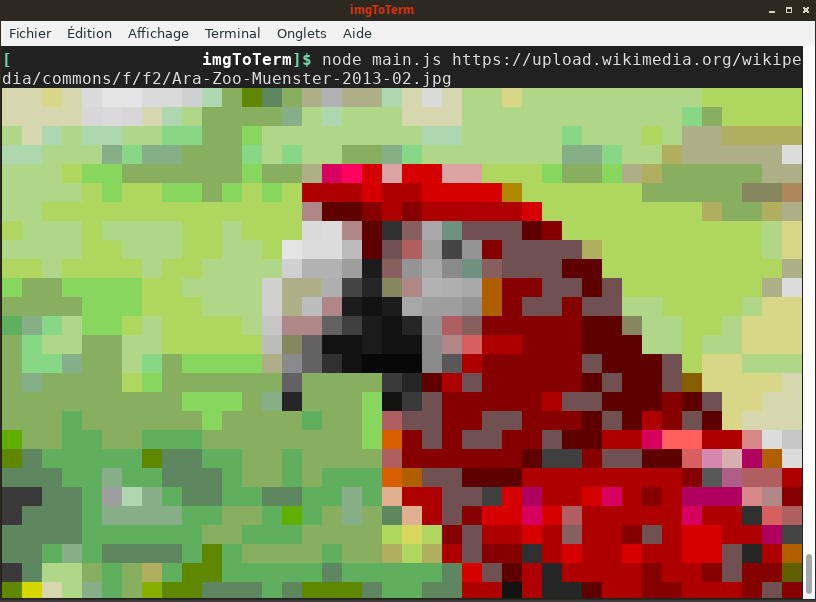

# imgToTerm
NodeJS utility to visualize images in a terminal using ANSI escape codes.

## installation

```
git clone https://github.com/corbin-c/imgToTerm.git
cd imgToTerm
npm install
```

## usage

``nodejs main.js http://url.of/img/to/display``

Output width matches the terminal columns.

### example

In order to visualize [this picture from Wikimedia Commons](https://upload.wikimedia.org/wikipedia/commons/f/f2/Ara-Zoo-Muenster-2013-02.jpg): 

``nodejs main.js https://upload.wikimedia.org/wikipedia/commons/f/f2/Ara-Zoo-Muenster-2013-02.jpg``

Expected output:


## server use

Alternatively, imgToTerm can handle HTTP requests if started with `--server`
option. It will expect a mandatory `target` parameter. Output width is 80 columns
by default, it can be set manually with `width`.
Called with no parameter, this help is displayed. Request should be curled in
order to make some sense...

### example

Server started locally on port 5000, getting the same image as above with 120
cols width:

```
curl "http://localhost:5000/?target=https://upload.wikimedia.org/wikipedia/commons/f/f2/Ara-Zoo-Muenster-2013-02.jpg&width=120"
```

or using the demo server at <https://termimg.herokuapp.com/>:

```
curl "https://termimg.herokuapp.com/?target=https://upload.wikimedia.org/wikipedia/commons/f/f2/Ara-Zoo-Muenster-2013-02.jpg&width=120"
```
